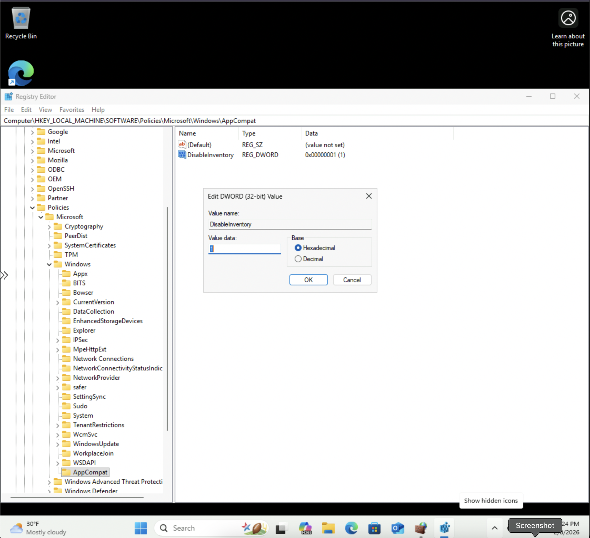
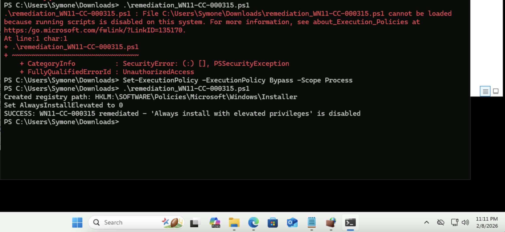

# Windows STIG WN11-CC-000315 Remediation

## Overview
This repository contains remediation for STIG vulnerability WN11-CC-000315: "The Windows Installer feature 'Always install with elevated privileges' must be disabled."

## Vulnerability Details
- **STIG-ID**: WN11-CC-000315
- **Severity**: CAT II
- **Description**: Standard user accounts must not be granted elevated privileges. Enabling Windows Installer to elevate privileges when installing applications can allow malicious persons and applications to gain full control of a system.

## Remediation Methods

### Automated (PowerShell Script)
Run the `remediation_WN11-CC-000315.ps1` script as Administrator to automatically disable the feature.

**To run:**
```powershell
PS C:\> .\remediation_WN11-CC-000315.ps1
```

### Manual (Registry Editor)
1. Open Registry Editor (`regedit`)
2. Navigate to: `HKEY_LOCAL_MACHINE\SOFTWARE\Policies\Microsoft\Windows\Installer`
3. Create or modify the DWORD value `AlwaysInstallElevated`
4. Set the value to `0`
5. Restart the system

## Screenshots

### Before Remediation


### After Remediation (Manual)


### PowerShell Automated Remediation Success


## Testing Information
- **Tested By**: Symone-Marie Priester
- **Date Tested**: February 8, 2025
- **System**: Windows 11 Pro
- **PowerShell Version**: 5.1
- **Methods**: Both automated (PowerShell) and manual (Registry Editor)

## Repository Structure
```
├── remediation_WN11-CC-000315.ps1         # PowerShell remediation script
├── AddAppCompatKey_Screenshot.png         # Before remediation
├── DisableInventory_Screenshot.png        # After remediation (manual)
├── WN11-CC-000315_PowerShell_Success.png  # PowerShell remediation success
└── README.md                              # This file
```

## Author
**Symone-Marie Priester**
- LinkedIn: [linkedin.com/in/symone-mariepriester](https://linkedin.com/in/symone-mariepriester)
- GitHub: [github.com/Symone-Marie](https://github.com/Symone-Marie)
